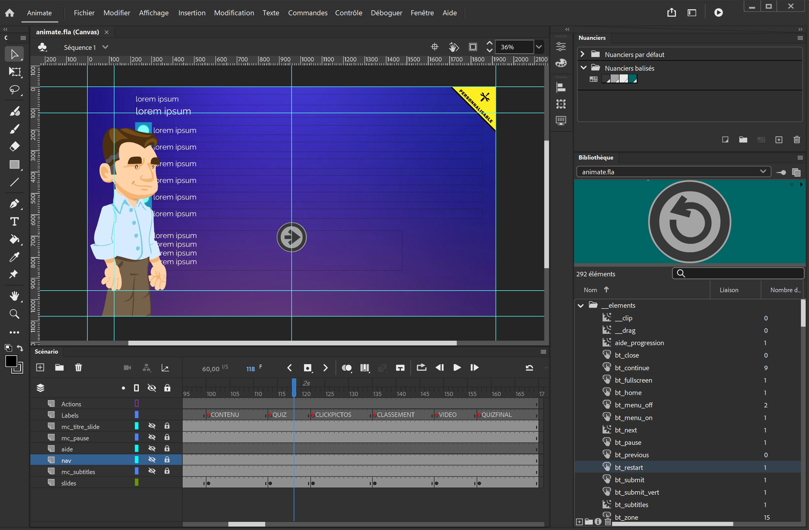
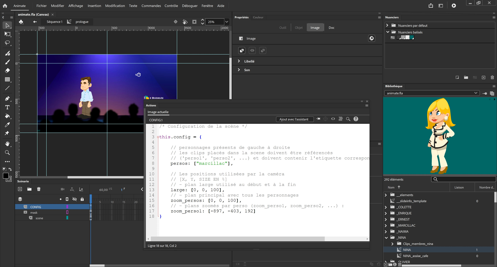
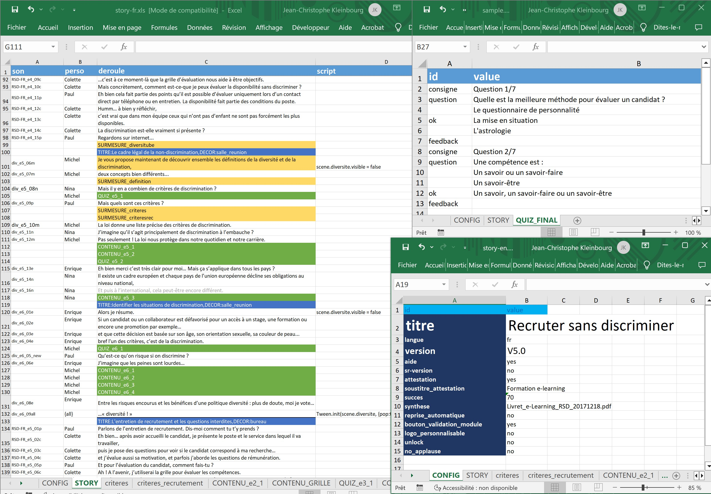
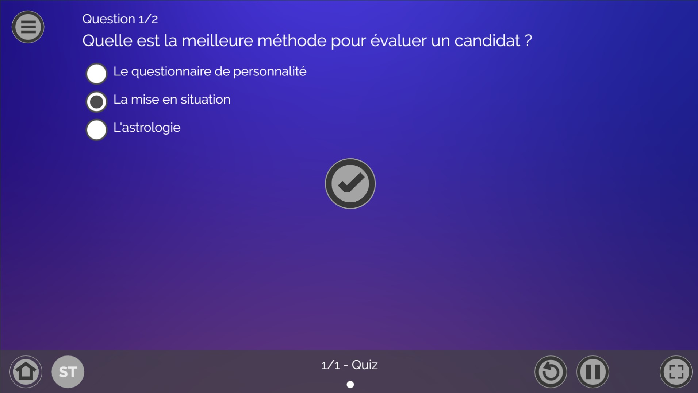

# story-engine-animate-js

# About

## Toolbox and Ready-to-Use Template for Stories* in JavaScript with Adobe Animate

### [[Click here to launch repository source sample]](https://realjck.github.io/story-engine/SOURCE/index.html)

_* A story presented in a linear format with chapters, featuring animated characters with voice-overs. Each chapter includes scenes, informative content screens, quizzes, and other interactive activities. The content is integrated with bookmarks and tracking functionality for Learning Management Systems, such as Moodle._

## Features:

- **Cross-Platform:**
   Compatibility on Chrome/Safari, and other web browsers with responsive and full-screen modes, mobile detection handling.

- **Interactivity:**
   Digital-learning activities such as multiple-choice quizzes, classification exercises, click interactions, and drag-and-drop features. Additionally, allows the creation of custom interactive activities using external JS files and JSON content.

- **Content Management:**
   Implements content handling through XLS parsing, integrated within an Excel file included in the package and parsed at launch.

- **LMS Compatibility:**
   Supports both SCORM 1.2 and 2004 standards for Learning Management Systems, with automatic detection of connection modes for standard web usage.

- **Integrated Video Content:**
   Video integration with media-element.js.

- **Packaged JS Libraries and Resources:**
   No CDNs or external dependencies. All libraries are statically copied for packaging (assets/libs/).

- **Resource Preloading:**
   Sounds and image assets are preloaded upon launch.

- **Error Handling:**
   In the event of a JavaScript error, generates a detailed PDF report and prompts the user to download it through a modal interface.

- **Multilingual Storyboards Management:**
   Offers language selection at launch, providing users with a multi-language experience.

- **Auto-Generated Certificates and PDFs:**
    Enables learners to download personalized final quiz reviews and school-branded certificates, featuring their name, score, and other details.

- **Customizable:**
    Includes the source code in the repository, feel free to clone or fork the project and customize it according to your needs.

## JS Librairies included:
- **Dojo Toolkit 1.17.3**
- **Create JS 1.0**
- Bootstrap 3.3.7 + bootstrap3-dialog
- download.js
- fontawesome 4.7.0
- jquery 1.12.4
- jquery easing 1.3
- js.cookie 2.1.4
- jspdf 1.5.3
- mediaelement.js
- moment.js with locales
- pipwerks SCORM API
- pleaserotate.js
- scroll-container-plus.js
- sheetjs / xlsx.js
- shortcut.js

## Important note

The entire project has been developed in ECMAScript Edition 5 (ES5), specifically tailored for utilization with the Dojo toolkit. The primary motivation for employing the Dojo toolkit was the capacity for asynchronous module handling at the time I started to make the main framework (2012).

This entails the utilization of `var` and DOM-declared variables, as well as the non-arrow function syntax `function(){}`.

Although updating to a more recent ECMAScript version may offer advantages for future development, it is currently not considered necessary. The tool has undergone optimization over the years, ensuring compatibility with major browsers including Chrome, Mozilla, Internet Explorer (no longer necessary, hopefully), and Safari on both desktop and mobile platforms.
## Usage

Clone the whole repository. All JS librairies are directly included (no installation).

## Design integration in Adobe Animate:

File `SOURCE/Animate.fla`

### Customize graphic elements:

Within Adobe Animate, the library consolidates UI-related elements within a designated __elements subdirectory. Characters and scene elements are situated both at the root level and in their respective directories. For optimal project organization when utilizing custom graphics, it is advisable to streamline the library by removing all root-level elements, with the exception of the __elements directory.

{width=100} 

To ensure proper preparation of custom scenes in Adobe Animate, it is imperative to maintain consistent nomenclature across three key components for the scenes MovieClips:

1. Name of the MovieClip in the library
2. Instance name in properties once positioned on the timeline
3. Label of the frame at the MovieClip position

When incorporating characters, adhere to the specific integration guidelines outlined in the project. Characters are consolidated within a primary MovieClip named _PERSOS. It is crucial to assign identical names to both their instance and corresponding label. Additionally, essential JavaScript variables should be positioned at the root of the scene, specifying the character names and scene coordinates when the character is zoomed in during dialogue. See screenshot below:

# Integration Instructions

## Generating the storyboard from a Word document (formatted with Styles as outlined in the template):

### Launch `XLS_CONSTRUCTION/CONSTRUCTION WORD IMPORTER.xlsm` and run the VBA script included inside.

### Select the Word document for conversion to Excel

### Within the generated XLS file, execute the following actions:
- Set all titles as `TITRE:......,DECOR:.....` to define the Animate scenes desired for each chapter
- Ensure that the final quiz sheet is named QUIZ_FINAL

# Possible Modifications in the Excel workbook:

## Story sheet:

### 'deroule' column:

Syntax	| Description
--- | ---
`CONTENU_xxxxxx` | Content screen with anchoring + images
`QUIZ_xxxxxx` | Multiple-choice quiz
`VIDEO_myvideo` | plays the video assets/videos/myvideo.mp4 (recommended format: 1280x640, .mp4 (h264), around 700kbs)
`DECOR:______` | allows a transition of the background within a chapter
`DECOR:______,FADE:true` | same as above but with a fade-in effect to black
`SURMESURE_myactivity` | Go to frame labelled 'myactivity' on main timeline and play app/myactivity.js — cf. 'SURMESURE' examples in app/ fodler
`SURMESUREONSCENE_myactivity` | Allows activity on current scene with playing app/myactivity.js — cf. 'SURMESUREonSCENE' example in app/ fodler

### 'perso' column:

Syntax	| Description
--- | ---
`perso{turn}` or `perso{turnstay}`	|	turns the character to the other side at the time of the line, either once or permanently
`{all}`	|	lip synchronization of the sound on all characters in the scene (chorus)
`{none}`	|	no lip synchronization (e.g., sound effect)

### 'anim' column (optionnal):

You can specify here the label in Adobe Animate that corresponds to the character animation to play during the dialogue. If no animation is specified in this column (i.e. in the whole story), all animations will be played randomly.

### 'script' column (optionnal):

Possibility to add JS script in the 4th column of the STORY sheet. Example: `Tween.init(scene.pot_de_fleur, {pop:true})` - the keyword 'scene' corresponds to the MovieClip of the current scene

## SYNTAX OF 'QUIZ_xxx' SHEETS:

Copy and paste questions from an existing model (the 'instruction' line is optional, and the 'feedback' line is mandatory (leave empty if not used).

A sheet has the capacity to include any quantity of questions.

A question can have up to six answers.

The correct answer is indicated by the word `ok`. It is possible to have one correct answer (QCU) or multiple (QCM)
Note that it is possible to force the possibility of multiple answers for a QCU by using `okm` instead of `ok`.

## Syntax of 'CONTENU_xxx' sheets:

### 'texte' column:

Syntax			|	Description
--- | ---
`xxxxxxxxxx`		| 	< normal-sized text
`GRAS:xxxxxxxxx`	|	< bold text
`SMALL:xxxxxxxxx`	|	< smaller text
`-xxxxxxxxxxxxx`	|	< smaller text with bullet point
`espace`			|	< space line

### 'media' column:

Syntax			|	Description 							
 ---- | ----
`IMG:xxxxx.png`	| 	< adds an image to the left of the text (extends in height when repeated over several consecutive cells)
`IMGLINE:xxxxx.png`	|	< adds an image to the left of the height of the first line of text
`IMGCORNER:xxxxx.png`	|	< adds an image in the top right of the screen
`SON:xxxxxx.mp3`	|	< adds sound in sync with the line (requires a character)

### Possibility of dialog with a character in an informative text/images content screen (with the lines of dialog read from the STORY sheet):

**Example:** `CONTENU_MYCONTENT,4` where:

- `CONTENU_MYCONTENT` references the corresponding content sheet in the workbook

- `,4` corresponds of the 4 next lines of character dialog in the STORY Sheet below the command

Will lead to this result :

> If the value of 4 matches the number of lines in the corresponding CONTENU_MYCONTENT sheet, it means that the texts and voice-overs are synchronized in their appearance. Alternatively, if the number of lines of CONTENU_MYCONTENT is different than 4, theses 4 lines of dialogue are spoken after all the content elements have been presented on the screen.

> Note that it is also possible to put voice-over sounds in the SON column of the content sheet (see table above), but these **do not display subtitles** because it is considered that they take up the audio reading of the displayed text.

---

# Finalization / SCORM Export / Online Publishing:

## Save the Excel in assets/data/ and edit `app/data/ExcelName.js` to indicate its filename:

Filename of Excel workbook can be any name:

~~~~
	var __ExcelName = "MyStoryV1.xls";
	var __Langs = ["en"];
~~~~

### Define multi-language (optional):

In the case of multi-language (__Langs size > 1), several Excel files must be in the data/ folder, each ending with "-XX" (XX corresponding to the corresponding language)

**Example of ExcelName.js for multilingual fr + en:**

~~~
	var __ExcelName = "story.xls";
	var __Langs = ["en", "fr"];
~~~

(In this case, the corresponding Excel files will be `story-fr.xls` and `story-en.xls`)

### Modify the configuration file `assets/app/CONFIG.js` for SCORM packaging (if required)

**Enables customization of the following options:**

- `__lang: string` - The initial language setting upon launch pertains to the messages preceding the module's initiation. After launch, the language is dynamically detected based on the specification in the Excel CONFIG sheet.

- `__nofs: bool` - The option to enable or disable full-screen mode is provided. In certain deployment environments, full-screen functionality may encounter limitations. To address this scenario, this option can be configured to `true` to conceal the full-screen button within the interface.

- `__disableAjax: bool` - During startup, the module conducts AJAX requests to determine the existence of SCORM 1.2 / 2004 files. If there is a need to disable these requests, this option can be set to `true`. In such instances, it is necessary to manually declare the SCORM version in `app/launcher.js` at line 54: `__scorm = "1.2"` (or "2004"). Additionally, the SCORM detection can be turned off by modifying line 55 to change `__gm = "lms"` to `"web"`.

### Make sure that `index.html` is in production mode

~~~~
!-- to modify for prod -->
<!--  -->
<!--  -->

~~~~

### Clean and prepares the solution

Instructions for preparing the production files are documented in file names beginning with underscore (`_lorem ipsum`) in the source and assets folders. These files should of course be excluded for production as well as the assets/app_src/ folder.

**The `SOURCE/` folder is the web root (or zip root in case of a LMS package).**

**Web:**
~~~~
./
├── assets/
├── animate.js
└── index.html
~~~~

**SCORM 1.2 .zip:**
~~~~
Package.zip/
├── assets/
├── animate.js
├── index.html
├── imsmanifest.xml
└── <.xsd files>
~~~~

### Execution in Browser / LMS Environment (Moodle, etc.):

---

# Guidance for development and build:

Folder `SOURCE/assets/app_src/`:

Package folder in `app_src/` | Description
--- | ---
`/dojo/` | Dojo Toolkit 1.17.3
`/animator/` | related to Adobe Animate (tween objects, buttons, quizzes, drag-drop, ...)
`/engine/` | main modules (`Player.js` contains the methods for the UI, Launch and SCORM, `ChapitrePlayer.js` contains the methods that parse the storyboard into playable actions)
`/util/` | modules not related to Adobe Animate (JsonHandler, Bootstrap modals, timers, sound management, etc.)
`/pdf/` | for pdf generation (see module `EasyPDF.js`)

### Comment/Uncomment these lines in `index.html` to switch between development and production mode:

~~~~
!-- to modify for prod -->
<!--  -->
<!--  -->

~~~~

A Windows batch file is ready to use to recompile the source: open a cmd console and launch `SOURCE/assets/app_src/COMPILE.BAT` (For Linux / Mac users you can find .sh scripts as well in `app_src/dojo/util/buildscripts/`)

This will compile the `app_src/` files into a new file in `app/App.js.uncompressed.js`.

> Please be advised that the generated file is in an uncompressed state, and the minified version of App.js has been omitted due to potential compatibility issues with certain modern browsers arising from Dojo's minimization process compounded by the inclusion of jQuery syntax. Should you desire a minified version, you have the option to employ a minification tool of your choosing.

---

# 📎 [License](COPYING.md) 
